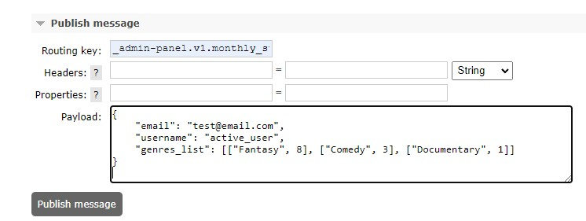

# Проектная работа 10 спринта
Задачи можно посмотреть в /tasks

## Ссылка на репозиторий с проектом:
https://github.com/AlexanderNkn/notifications_sprint_1

## Описание
Сервис нотификации оповещает пользователя о событиях посредством email рассылки. Возможно расширение для sms и push уведомлений. События могут быть как мгновенными, например приветственное письмо при регистрации нового пользователя, так и периодическими, например статистика в конце каждого месяца по просмотренным пользователем фильмам.

## Архитектурные решения
- описание диаграмм в формате plantUML представлено в docs/architecture/

### Работа в 10 спринте


### Описание диаграммы
Сервисы по результатам своей работы отправляют события в общую шину событий. Например сервис scheduler может выставить событие, что пора сделать еженедельное напоминание пользователям о кинотеатре. Сервис auth может сообщить, что зарегистрировался новый пользователь. Менеджер через админ-панель сообщает, что вышел новый сериал. Любое событие каждый сервис не зависимо друг от друга шлет в общую шину событий (в данном случае в kafka).

Сервис нотификаций слушает соответствующие топики и при наступлении события вызывает функцию-обработчик этого конкретного события. Функция обработчик сначала обращается в auth за данными пользователей, которым нужно выслать оповещение, затем в остальные сервисы за связанными данными. К примеру, чтобы подготовить ежемесячную статистику, нужно по user_id в сервисе ugc найти все просмотренные этим пользователем фильмы за последний месяц, а по полученным из ugc идентификаторам movie_id из сервиса movies-api выгрузить жанры фильмов. Тогда в статистике будет понятно, какие жанры предпочитал смотреть пользователь последний месяц.

В зависимости от таймзоны пользователя, может потребоваться отправить сообщение через некоторое время. В этом случае, идентификаторы пользователей, сгруппированные по таймзонам, помещаются в redis, а сервис нотификаций ставит в scheduler новый план - перезапустить определенную задачу через определенное время. Но на этот раз сервис нотификаций будет использовать только списки пользователей, соответствующие таймзоне задачи (по ключу запросит из redis)

Сообщения, готовые к отправке, сервис нотификаций выставляет в очередь rabbitmq и добавляет шаблон, который нужно использовать при рассылке. При необходимости срочные сообщения можно выкладывать в отдельную очередь и обрабатывать ее бОльшим количеством воркеров.

Воркер забирает сообщение из очереди, помещает данные в шаблон (используем Jinja2) и отправляет письмо. 

## Установка
- склонируйте проект с репозитория GitHub
    ```
    git clone https://github.com/AlexanderNkn/notifications_sprint_1.git
    ```
- переименуйте файл с переменными окружения для тестирования
    ```
    mv notifications/envs/.notifications.env.sample notifications/envs/.notifications.env
    mv email/envs/.email.env.sample email/envs/.email.env
    mv email/envs/mailhog-auth.sample email/envs/mailhog-auth
    mv scheduler/envs/scheduler.env.sample scheduler/envs/scheduler.env
    ```
- соберите образ
    ```
    docker-compose build --no-cache
    ```
- запустите проект
    ```
    docker-compose up -d
    ```

## Использование
- В данном спринте не подключены сервисы, через которые можно вручную выслать события в общую шину событий (например регистрация пользователя в auth). Добавлен сервис Sheduler, но он отправляет события в автоматическом режиме.
- Для тестирования, в scheduler создан метод, который высылает все события при перезапуске контейнера.
    ```
    docker-compose restart scheduler
    ```


- События поступают в Kafka


- Затем из Kafka после обрабоки в очередь RabbitMQ. Для просмотра перейдите в браузере на страницу RabbitMQ
    ```
    http://localhost:15672/#/queues/%2F/_emails.send-monthly-statistic_
    ```
- Поступление данных в очередь


- Пример ответа с данными для письма


- Для просмотра отправленных писем перейдите на страницу Mailhog (логин:пароль = test:test ) 
    ```
    http://localhost:8025/
    ```
  

### Тестовая отправка данных:
- Пример отправки в Kafka триггера для генерации месячной статистики
    ```
    curl --location --request POST 'localhost:8082/topics/monthly_statistic' \
    --header 'Content-Type: application/vnd.kafka.json.v2+json' \
    --data-raw '{
      "records": [
        {
          "value": {
              "event": "send_statistic"
          }
        }
      ]
    }'
    ```

- Пример отправки данных напрямую в очередь RabbitMQ. Перейдите в браузере на страницу
    ```
    http://localhost:15672/#/exchanges/%2F/test-exchange
    ```
- Введите тестовое сообщение в разделе **Publish message**
  